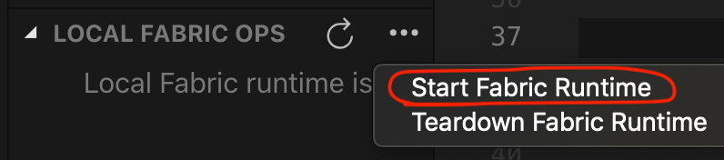
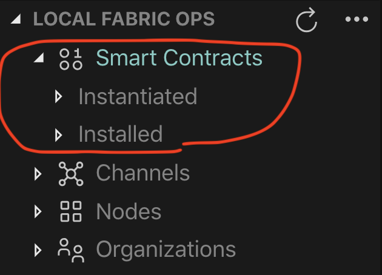
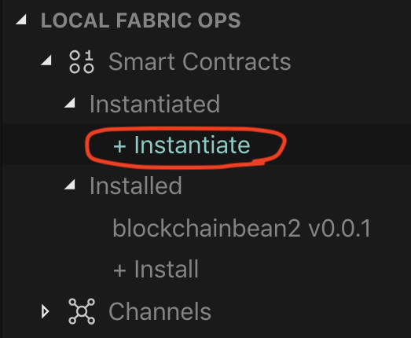
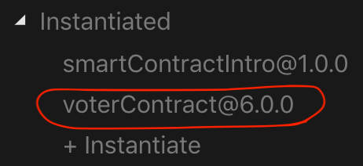
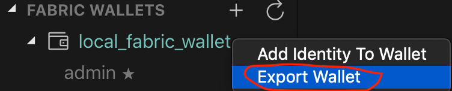
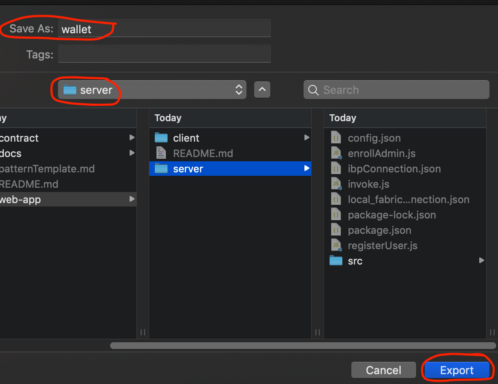

# Tutorial VotingSys

# Passos

1. [Iniciar o Hyperledger Fabric Runtime]()
2. [Instalar o Smart Contract ]()
3. [Instanciar o Smart Contract]()
4. [Exportar os Detalhes de Conexão]()
5. [Rodar o programa]()
6. [Criar uma nova eleição]()

Para seguir este tutorial você irá necisstar do Visual Studio Code e a extensão IBM Blockchain VSCode, além do Docker para montar a rede Blockchain do Hyperledger Fabric. 

## 1. Iniciar o Hyperledger Fabric Runtime
- Clicar no ícone da extenão IBM Blockchain Extension dentro do Visual Studio. Este ícone é um quadrado, e geralmente é o último ícone do Visual Studio do lado esquerdo.
- Na aba "FABRIC ENVIRONMENTS", clique no simbolo dos três pontinho e escolha a opção *Start Fabric Runtime*.
  <p align="center">
    
  </p>
  
- Quando este processo terminar, dentro da aba "FABRIC ENVIRONMENTS" irá aparecer o diretório Smart Contracts, com os subdiretórios Instantiated e Installed.

  <p align="center">
    
  </p>


## 2. Instalar o Smart Contract 

Agora, clique em + Instalar e escolha o par que está disponível. A extensão perguntará qual pacote deve ser
instalar. Escolha voterContract@7.0.0, que está no diretório 'votingsys/contract' que você acabou de clonar.
 
Se tudo der certo, a notificação abaixo será exibida


##  3. Instanciar o Smart Contract 
  Clique em *+ Instantiate* 

<p align="center">
  
</p>

Escolha o canal *mychannel* para instanciar o contrato


Agora, escolha o Smart Contract

Em seguida, na opção: optional: What function do you want to call? Digite *init*.


Deixe os argumentos em branco e pressione Enter


Isso instancia o Smart Contract. Você deve ver o contrato
sob subdiretório *Instantiate* no lado esquerdo, como mostra a figura.


<p align="center">
  
</p>

## 4. Exportar os Detalhes de Conexão

- Na aba "FABRIC GATEWAYS", clique no símbolo dos três pontinhos e clique em *Export Connection Profile* e escolha o diretório de destino: `votingsys/web-app/server`. 

#### Exportar Carteira

- Na aba "FABRIC WALLETS", clique com o botão direito em `local_fabric_wallet` e selecione *Export Wallet*. 

<p align="center">
  
</p>

- Selecione o diretório destino: `votingsys/web-app/server`, e salve-a com o nome "wallet"

<p align="center">
  
</p>

#### Atualize as configurações

Agora, atualize o aquivo `config.json`, localizado em: `web-aap/server`, com o seguinte código:

```json
{
  "connection_file": "local_fabric_connection.json",
  "appAdmin": "admin",
  "appAdminSecret": "adminpw",
  "orgMSPID": "Org1MSP",
  "caName": "ca.org1.example.com",
  "userName": "V1",
  "gatewayDiscovery": { "enabled": true, "asLocalhost": true }
}
```

## 5. Rodar o programa
Para executar o aplicativo, precisaremos instalar dependências para nosso front-end e back-end. 

#### Back-end
  - Primeiro, entre a do diretório `server` e instale as dependências 

    ```bash
    cd /web-app/server
    npm install
    ```
  - Inicie o servidor: 
    ```bash
    npm start
    ```
  - Se tudo der certo, a saída do terminal deve ser a seguinte:
    ```

      [nodemon] 1.19.1
      [nodemon] to restart at any time, enter `rs`
      [nodemon] watching: *.*
      [nodemon] starting `node src/app.js`  
    ```

#### Front-end 

- Primeiro, entre a do diretório `client` e instale as dependências 
  ```bash
  cd /web-app/client
  npm install
  ```
- Inicie o cliente: 
  ```bash
  npm run serve
  ```
- Se tudo der certo, a saída do terminal deve ser a seguinte:
  ```
      DONE  Compiled successfully in 6803ms                                                                                             

      App running at:
      - Local:   http://localhost:8080/ 
      - Network: unavailable

      Note that the development build is not optimized.
      To create a production build, run npm run build. 
  ```
Pronto, a aplicação está funcionando. 

## 6. Criar uma nova eleição

Para criar uma nova eleição devemos modificar os arquivos JSON com os dados de eleição e candidatos, electionData.json e candidatesData.json, respectivamente. 

Após estes arquivos modificados, realizar o backup para um lugar seguro da pasta wallet, localizada em `/web-app/server`.

Desconectar o Fabric Local em "FABRIC ENVIRONMENTS" e seguir o tutorial novamente a partir do Tópico 1.
